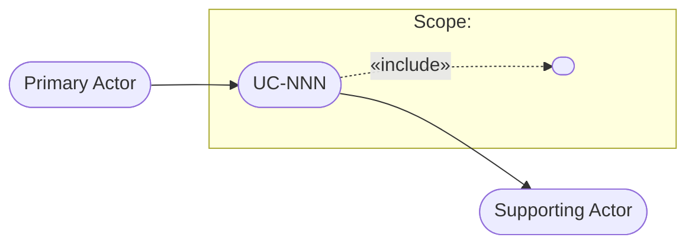

# Use Case Template

This is the canonical template — the single copy, owned by prime-core. If the project's `prime-config.md` declares a custom template path or additional mandatory sections, the project configuration takes precedence.

## File naming convention

`docs/use-cases/UC-NNN-short-title.md` (e.g., `UC-042-export-report-pdf.md`). `NNN` is a zero-padded sequential number, stable for the life of the document. Never renumber existing use cases.

## Document structure

````markdown
# UC-NNN — [Use Case Title]

| Field | Value |
|---|---|
| **ID** | UC-NNN |
| **Name** | The primary actor's goal, expressed as verb + object (e.g., *Buy Merchandise*) |
| **Scope** | The system under consideration (software system, subsystem, or organization) |
| **Level** | Summary · User goal · Subfunction |
| **Actors** | Who has the goal this use case satisfies (primary actor; secondary actors if any) |
| **Related use cases** | UC-XXX links, or "none" |
| **Status** | Draft · Reviewed |

## Stakeholders and Interests

[OPTIONAL — include only when the source material (story, PRD, elicitation, code) reveals stakeholder interests. Omit the section entirely rather than inventing content.]

- **<Stakeholder 1>**: <what they expect the system to protect or guarantee>
- **<Stakeholder 2>**: <interest>

## Conditions

**Preconditions**
<What must be true before the use case starts — and that the use case does not need to check.>

**Minimal Guarantees**
<What the system guarantees to stakeholders even if the use case fails. E.g., audit logging.>

**Success Guarantees**
<The state of the world after the use case ends successfully.>

## Main Success Scenario

1. <Actor> <action in simple present tense, active voice>.
2. <System> <action>.
3. <Actor> <action>.
4. <System> <action>.
5. <System> <action that completes the goal>.

## Extensions

- **2a.** <Alternative or failure condition at step 2>:
  - 2a1. <Handling action>.
  - 2a2. <Return to step X | Use case ends in failure>.
- **4a.** <Condition>:
  - 4a1. <Action>.
- ***a.** <Condition that may occur at any time>:
  - *a1. <Action>.

## Business Rules
- **RN-1:** [Rule referenced by the flows, stated precisely and testably]

## Acceptance Criteria
- **CA-1:** Given [context], when [action], then [verifiable outcome]
[Every criterion must be objectively verifiable. Cover the Main Success Scenario and every extension.]

## UML Diagram (graphical summary)

[Scope rule: the diagram shows THIS use case, its actors, and its direct relations only
(«include»/«extend» and directly related use cases). It is never a system-wide map —
the repository as a whole is the map. Update the diagram whenever a change to the flows
alters actors or relations; diagram-only updates are NOT delta items in the Revision
History (the diagram is derived from the flows — the behavioral change is the delta).]



## Revision History
| Rev | Story | Date | Summary of changes |
|-----|-------|------|--------------------|
| 1 | S-NNN or "initial mapping from code" | YYYY-MM-DD | [Added/changed/removed items, referencing step, extension, and section identifiers — e.g., "Added extension 3b; changed step 5; removed RN-4"] |
[Keep only the 5 most recent entries. Full history lives in version control.]
````

## Status lifecycle

- **Draft** — work in progress, or containing unresolved uncertainty markers. Not source of truth.
- **Reviewed** — validated by a human; all uncertainty markers resolved. Source of truth for system behavior; valid input for the ITS Generator.

Promotion from Draft to Reviewed is always a human act — no skill promotes status on its own.

## Quality rules

Enforce all of these before considering a document done:

1. Intent level, not interface level. No UI widget names in scenarios or extensions.
2. Every extension has a defined outcome: it either returns to a numbered step or ends the use case (in success or failure). No dangling extensions.
3. Every acceptance criterion is verifiable. No "the system should be fast" without a metric.
4. The Main Success Scenario and every extension have a corresponding acceptance criterion.
5. Every business rule (RN-N) referenced in a scenario or extension exists in the Business Rules section, and vice versa.
6. Minimal Guarantees state what holds even on failure.
7. The UML diagram covers this use case and its direct relations only, and is consistent with the Actors field and the Extensions.
8. Revision History entries always carry the originating story ID and reference the affected step, extension, and section identifiers — the ITS Generator depends on this to locate the delta. Diagram-only updates are never delta items.

## Uncertainty markers (used by Use Case Extractor)

When a document is reverse-engineered from code, mark unverified content:

- `[INFERRED]` — behavior deduced from code structure but not confirmed by tests or stakeholders.
- `[CONFIRM: question]` — an open question a human must answer (e.g., `[CONFIRM: is the 10-item limit a business rule or a technical constraint?]`).

A document containing uncertainty markers has Status "Draft" and must not be treated as source of truth until a human resolves the markers and promotes it to "Reviewed".
