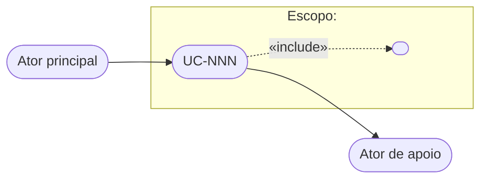

# Use Case Template

This is the canonical template — the single copy, owned by prime-core. If the project's `prime-config.md` declares a custom template path or additional mandatory sections, the project configuration takes precedence.

**Language.** The artifact block below is the document the writer produces, and it is written in the project's document language (`docs/prime-config.md` › Document repository; default `pt-BR`). The guidance around it is skill-facing and stays in English. Section titles are part of the artifact and are therefore translated; the **stable tokens** declared by prime-core/prime-config — identifiers (`UC-NNN`, `RN-N`, `CA-N`, `S-NNN`), status values (`Draft`, `Reviewed`), the uncertainty markers (`[INFERRED]`, `[CONFIRM: ...]`), file naming patterns and paths — are never translated, in any language.

## File naming convention

`docs/use-cases/UC-NNN-titulo-curto.md` (e.g., `UC-042-exportar-relatorio-pdf.md`). `NNN` is a zero-padded sequential number, stable for the life of the document. Never renumber existing use cases. The slug follows the document language; the `UC-NNN` prefix does not.

## Document structure

````markdown
# UC-NNN — [Título do caso de uso]

| Campo | Valor |
|---|---|
| **ID** | UC-NNN |
| **Nome** | O objetivo do ator principal, em verbo + objeto (ex.: *Comprar mercadoria*) |
| **Escopo** | O sistema em consideração (sistema de software, subsistema ou organização) |
| **Nível** | Resumo · Objetivo de usuário · Subfunção |
| **Atores** | Quem tem o objetivo que este caso de uso satisfaz (ator principal; atores secundários, se houver) |
| **Casos de uso relacionados** | Links UC-XXX, ou "nenhum" |
| **Status** | Draft · Reviewed |

## Envolvidos e interesses

[OPCIONAL — inclua apenas quando o insumo (story, PRD, elicitação, código) revelar interesses dos envolvidos. Omita a seção inteira em vez de inventar conteúdo.]

- **<Envolvido 1>**: <o que espera que o sistema proteja ou garanta>
- **<Envolvido 2>**: <interesse>

## Condições

**Pré-condições**
<O que precisa ser verdade antes de o caso de uso começar — e que o caso de uso não precisa verificar.>

**Garantias mínimas**
<O que o sistema garante aos envolvidos mesmo se o caso de uso falhar. Ex.: registro de auditoria.>

**Garantias de sucesso**
<O estado do mundo depois que o caso de uso termina com sucesso.>

## Cenário principal de sucesso

1. <Ator> <ação no presente simples, voz ativa>.
2. <Sistema> <ação>.
3. <Ator> <ação>.
4. <Sistema> <ação>.
5. <Sistema> <ação que conclui o objetivo>.

## Extensões

- **2a.** <Condição alternativa ou de falha no passo 2>:
  - 2a1. <Ação de tratamento>.
  - 2a2. <Retorna ao passo X | Caso de uso termina em falha>.
- **4a.** <Condição>:
  - 4a1. <Ação>.
- ***a.** <Condição que pode ocorrer a qualquer momento>:
  - *a1. <Ação>.

## Regras de negócio
- **RN-1:** [Regra referenciada pelos fluxos, enunciada de forma precisa e testável]

## Critérios de aceite
- **CA-1:** Dado [contexto], quando [ação], então [resultado verificável]
[Todo critério precisa ser objetivamente verificável. Cubra o Cenário principal de sucesso e todas as extensões.]

## Diagrama UML (resumo gráfico)

[Regra de escopo: o diagrama mostra ESTE caso de uso, seus atores e suas relações diretas
apenas («include»/«extend» e casos de uso diretamente relacionados). Nunca é um mapa do
sistema inteiro — o repositório como um todo é o mapa. Atualize o diagrama sempre que uma
mudança nos fluxos alterar atores ou relações; atualizações apenas de diagrama NÃO são
itens de delta no Histórico de revisões (o diagrama é derivado dos fluxos — o delta é a
mudança de comportamento).]



## Histórico de revisões
| Rev | Story | Data | Resumo das alterações |
|-----|-------|------|-----------------------|
| 1 | S-NNN ou "mapeamento inicial a partir do código" | AAAA-MM-DD | [Itens adicionados/alterados/removidos, referenciando identificadores de passo, extensão e seção — ex.: "Adicionada extensão 3b; alterado passo 5; removida RN-4"] |
[Mantenha apenas as 5 entradas mais recentes. O histórico completo vive no controle de versão.]
````

## Status lifecycle

- **Draft** — work in progress, or containing unresolved uncertainty markers. Not source of truth.
- **Reviewed** — validated by a human; all uncertainty markers resolved. Source of truth for system behavior; valid input for the ITS Generator.

Promotion from Draft to Reviewed is always a human act — no skill promotes status on its own. The status values are stable tokens: they are written `Draft` and `Reviewed` whatever the document language.

## Quality rules

Enforce all of these before considering a document done:

1. Intent level, not interface level. No UI widget names in scenarios or extensions.
2. Every extension has a defined outcome: it either returns to a numbered step or ends the use case (in success or failure). No dangling extensions.
3. Every acceptance criterion is verifiable. No "o sistema deve ser rápido" without a metric.
4. The `Cenário principal de sucesso` and every extension have a corresponding acceptance criterion.
5. Every business rule (RN-N) referenced in a scenario or extension exists in the `Regras de negócio` section, and vice versa.
6. `Garantias mínimas` state what holds even on failure.
7. The UML diagram covers this use case and its direct relations only, and is consistent with the `Atores` field and the `Extensões`.
8. `Histórico de revisões` entries always carry the originating story ID and reference the affected step, extension, and section identifiers — the ITS Generator depends on this to locate the delta. Diagram-only updates are never delta items.
9. The document is written end to end in the project's document language, with no stable token translated (`RN-N` never becomes `BR-N`, `Draft` never becomes `Rascunho`).

## Uncertainty markers (used by Use Case Extractor)

When a document is reverse-engineered from code, mark unverified content. The markers themselves are stable tokens and stay in English; their content follows the document language:

- `[INFERRED]` — behavior deduced from code structure but not confirmed by tests or stakeholders.
- `[CONFIRM: pergunta]` — an open question a human must answer (e.g., `[CONFIRM: o limite de 10 itens é regra de negócio ou restrição técnica?]`).

A document containing uncertainty markers has Status `Draft` and must not be treated as source of truth until a human resolves the markers and promotes it to `Reviewed`.